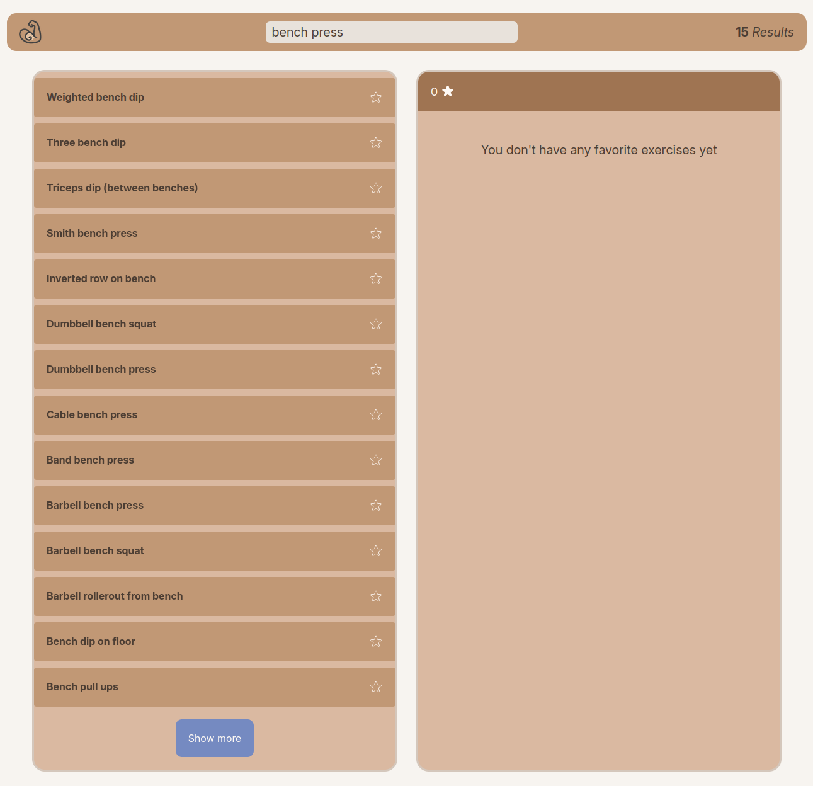
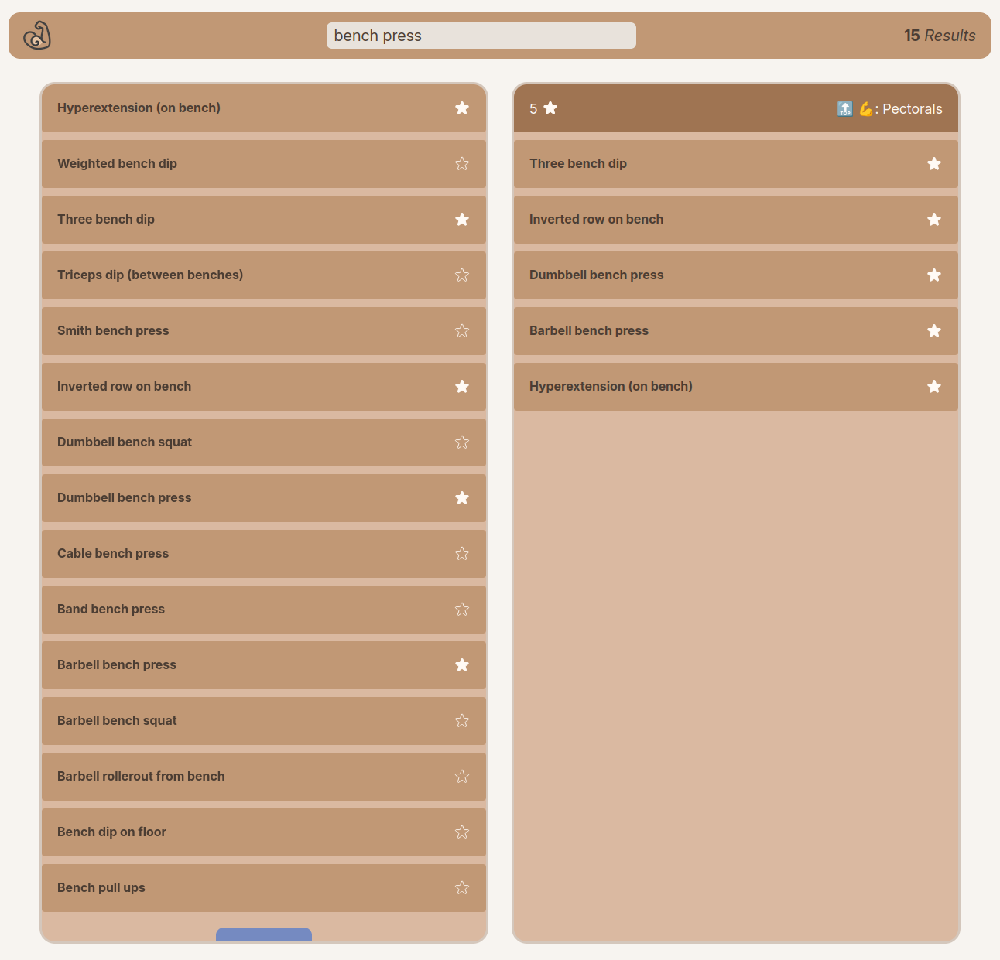
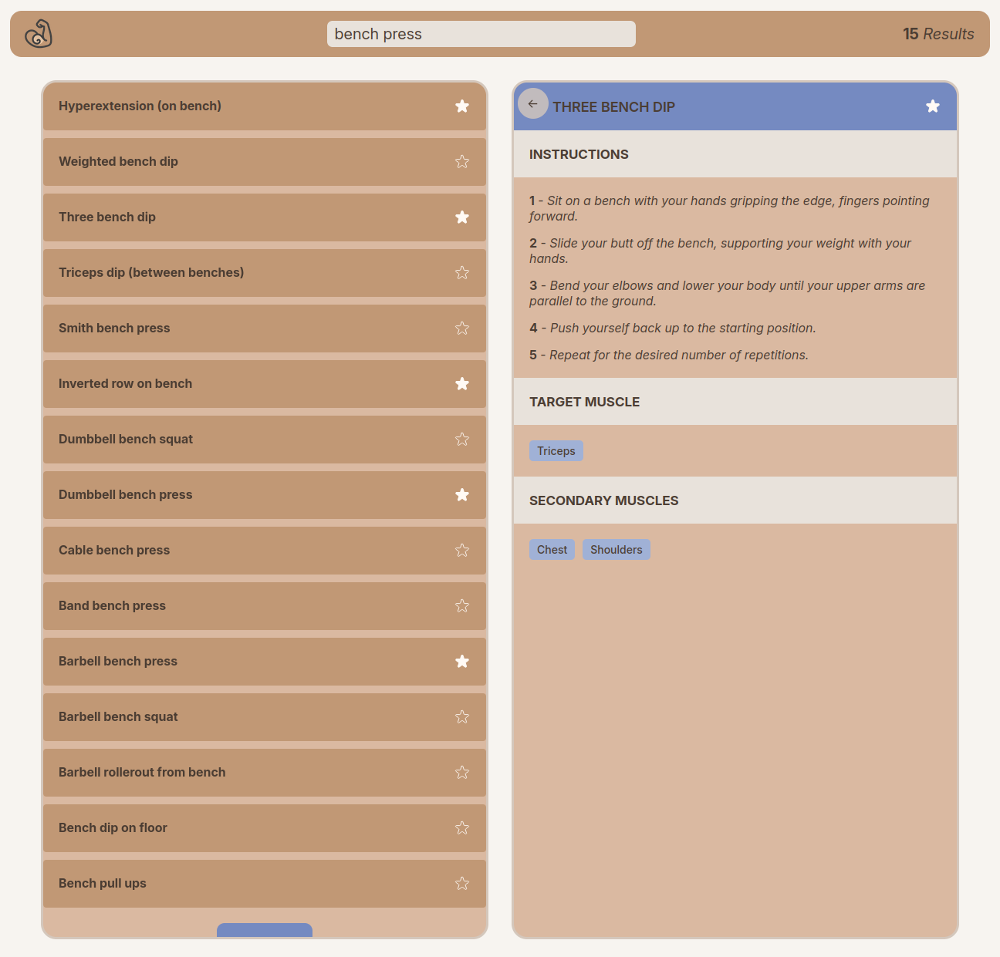

# 🌕 Project's purpose

This is a dummy project whose purpose is to fetch data from an external API via useEffect and custom hooks. In addition it uses the useRef hook and Component composition to avoid prop Drilling.

# 🚀 Features

- Fetches exercise data from external API (exercisedb-api.vercel.app/api/v1) as the user types.
- Button for fetching more paginated content if it exists.
- Shows number of found results.
- Fav/Unfav exercises. These are stored in the browser's local storage.
- Statistics about fav exercises:
  - Number of favs
  - Most targeted muscle.
- Details when clicking an exercise:
  - Instructions to perform it.
  - Target muscle.
  - Secondary muscles.
- Shortcuts:
  - _Enter_ key to clean and focus search bar.
  - _Escape_ key to close exercise details when is selected.
- Error message when data fetching goes wrong.
- Loading state.
- Messages when no info is available.

# 🗞️ Info

- This project is not meant to be 100% responsive.
- This project is not meant to solve a real life problem.
- Exercise images/videos are not shown due to finantial reasons. Free APIs are limited in this regard.

# 🖼️ Project's screenshots

<!-- Include image -->

## Initial view

## Fetch and show more

## Fav exercises

## Exercise details

